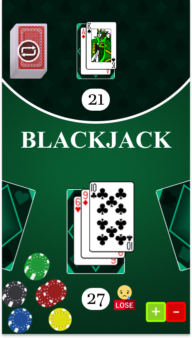
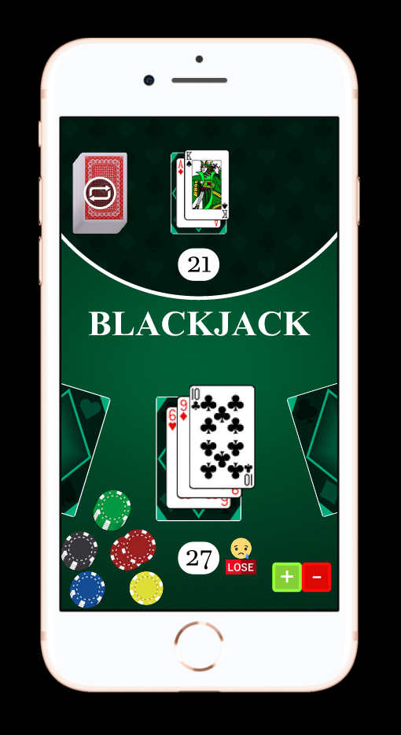

# Projeto de Blackjack para Mobile (iPhone 8)

Este é um projeto de desenvolvimento de um aplicativo de Blackjack para dispositivos móveis, especialmente para o iPhone 8. O objetivo é proporcionar uma experiência de jogo divertida e envolvente para os usuários.

## Tecnologias Utilizadas

O projeto foi desenvolvido utilizando as seguintes tecnologias:

- **Vite**: Um gerenciador de build rápido para projetos JavaScript. Ele permite a criação de aplicativos modernos, rápidos e eficientes.

- **Regras do Lint do Airbnb**: Foram adotadas as regras de linting recomendadas pelo Airbnb para garantir uma codificação consistente e de qualidade.

## Design UI/UX

O design do aplicativo foi criado seguindo as orientações do setor de Design UI/UX do Figma. O Figma é uma plataforma colaborativa de design que permite a criação e o compartilhamento de projetos de interface de usuário.

### Capturas de Tela

A seguir estão duas capturas de tela do aplicativo:

## Como Executar o Projeto

Siga as etapas abaixo para executar o projeto localmente:

1. Clone este repositório em sua máquina local.

git clone https://github.com/seu-usuario/nome-do-repositorio.git

2. Navegue até o diretório do projeto.

cd nome-do-repositorio

3. Instale as dependências do projeto.

npm install

4. Inicie o servidor de desenvolvimento.

npm run dev

5. Abra o aplicativo em seu navegador ou em um emulador do iPhone 8.

http://localhost:3000

## Contribuição

...

## Licença

Este projeto está licenciado sob a Licença ISC.
